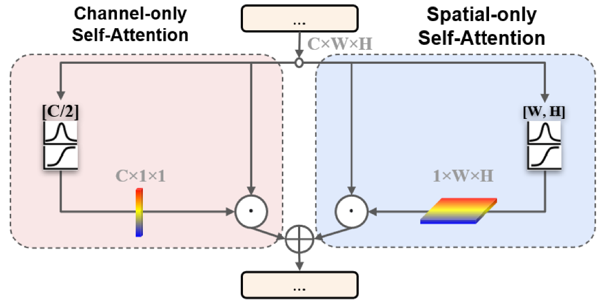
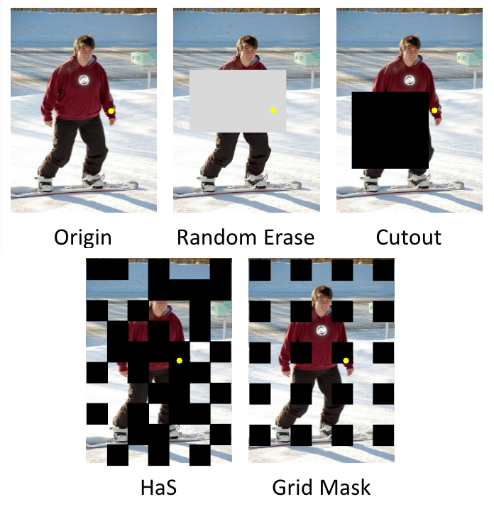

# AnimalDatathon_code.ipynb

Animal Datathon Korea 2021 code 제출본 readme file입니다.

## 개요   

한국축산데이터에서 구축한 가축 이미지 데이터를 활용하여 실제 구현 가능한 인공지능 학습 모델을 기획하고 개발하는 데이터톤 대회입니다.  
이미지 내에 존재하는 소들의 **Keypoint를 추출하는 Task** 입니다.

## 코드 사용

*AnimalDatathon_code* 파일을 서버의 기본 제공 세팅 그대로 사용할 수 있습니다.

## Cow Data EDA  

1. 소의 색상 값이 생각보다 다양함 (흰색~황색~흑색)
2. PCK 측정 기준인 Torso의 시작과 끝 3번과 10번 키포인트의 거리가 짧은 outlier 존재
3. 가장 높은 분포밀도를 지니는 width - length ratio는 1.2  
4. 데이터의 수 충분
5. 음영이 낮은 이미지가 많이 보임
6. 축사 구조물 혹은 사진이 찍힌 구도에 의해 keypoint 추출부가 일부 가려져 있음

## Model  

HRnet-Pose 모델이 정의되어 있습니다.  

그 외 추가로 [Polarized Self Attention](https://github.com/DeLightCMU/PSA) 이 사용되었습니다.

  
* 모델에 추가적으로 장착하는 Self-Attention 모듈
* 본 대회에서는 HRNet의 BasicBlock에 추가하였음
* 데이터의 전체적인 맥락을 파악하는 Self-Attention 기법을 활용함으로써 가려지는 키포인트들을 파악할 수 있다고 판단하였음

## 추가 데이터
추가 데이터의 경우 총 26장이며, 현재 폴더의 added_data에 보관해 놓았습니다.  


## 전처리  

Albumentation Library를 이용한 다양한 전처리 
(최종 모델제출파일에 사용된 전처리 목록)  
keypoint의 좌표 변환이 동반되는 전처리는 사용하지 않음


[AID, (Information Dropping Augmentation)](https://arxiv.org/pdf/2008.07139.pdf) 사용  

* 이미지의 정보를 의도적으로 Dropping 하는 전처리 기법
* 사진상 가려진 keypoint 추론을 보다 효과적으로 하고, Overfitting을 방지하기 위하여 사용되었음
## 후처리

[DARKpose, (Distribution-Aware coordinate Representation of Keypoint)](https://github.com/ilovepose/DarkPose) 사용  

* 모델이 추론한 heatmap을 modulation 한 후, 최대 밀도 분포에 기반하여 최종 추론값을 가공하는 후처리 기법
* 보다 정확한 Heatmap 분석 결과 좌표를 얻기 위하여 사용됨]

## 제출 파일
```
submission_1_2_emsemble.json
```
* 해당 파일은 리더보드 옆 제출 시간을 참고해 본 결과 private 기준 score로 선정된 것으로 확인되었습니다.  
  
```
submission_3_emsemble.json
```
* 해당 파일은 리더보드 옆 제출 시간을 참고해 본 결과 public 기준 score로 선정된 것으로 확인되었습니다.
  
## Code 구조

```
$ Result
├── added_data # 추가 data
│   ├── annotations
│   ├── images
├── code_1
│   ├── modules
│   │   ├── earlystoppers.py
│   │   ├── pose.py
│   │   ├── recorders.py
│   │   ├── trainer.py
│   │   └── utils.py
│   ├── hrnet-w48-train-ce-384x288.yaml
│   ├── losses.py
│   ├── main.py
│   └── model.py
├── code_2
│   ├── AID.py
│   ├── dataset.py
│   ├── hjs_model.py
│   ├── loss.py
│   ├── predict_tools.py
│   ├── PSA.py
│   ├── train.py
│   └── utils.py
├── code_3
│   ├── inference.py
│   └── train.py
├── Config # model config
│   └── heatmap_train2.yaml
├── weights # pretrained weight & train 결과 weights들
│   ├── cw_model.pt
│   ├── first_model.pt
│   ├── js_model.pth
│   └── pose_hrnet_w48_384x288.pth
├── inference_1_2_emsemble.ipynb # 앙상블 inference
├── submission_1_2_emsemble.json # private score 기준 상위 제출파일
├── submission_3.json # public score 기준 상위 제출파일
├── README.md
└── readme_img
```


## 

## How to Train  

#### 1. code_1 활용 Train

```
$ cd /Result/code_1/
$ python main.py --config ./hrnet-w48-train-ce-384x288.yaml
```

위명령어 실행시  /Result/weights 폴더 밑에 weight 생성


#### 2. code_2 활용 Train

```
$ cd /Result/code_2/
$ python train.py
```

위명령어 실행시  /Result/weights 폴더 밑에 weight 생성

#### 3. code_3 활용 Train

```
$ cd /Result/code_3/
$ python train.py
```

위명령어 실행시  /Result/weights 폴더 밑에 weight 생성

## How to Inference  

#### 1. code_1,2 weight 활용 inference

```
$ cd /Result/
$ python inference_1_2_emsemble.py
```

#### 2. code_3 weight 활용 inference

```
$ cd /Result/code_3/
$ python inference.py
```


## Contributors
[허재섭(shjas94)](https://github.com/shjas94)  
[조원(fokkersn)](https://github.com/jo-member)  
[송광원(remaindere)](https://github.com/remaindere)  
[신찬엽()]()  

